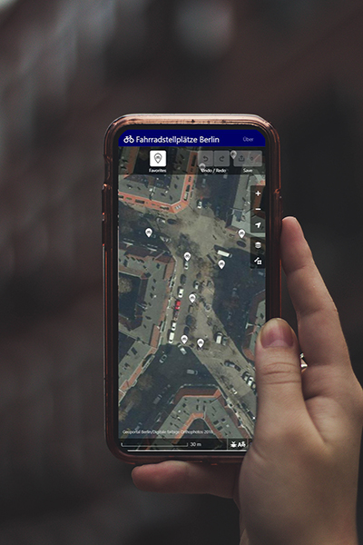
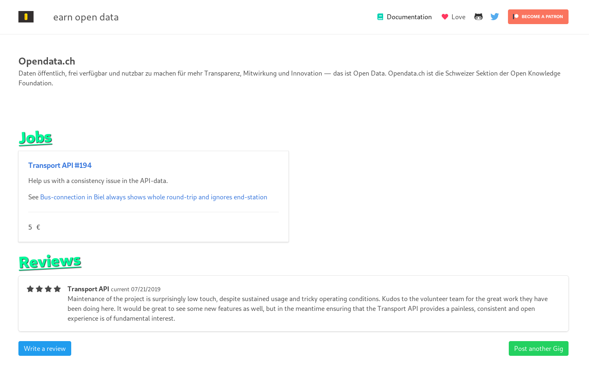
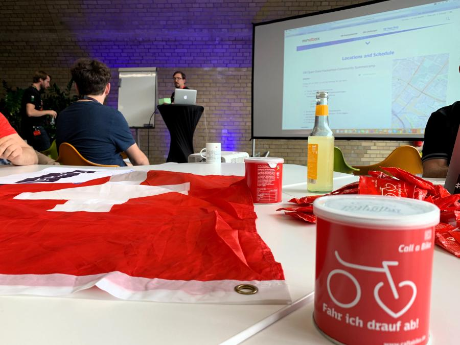
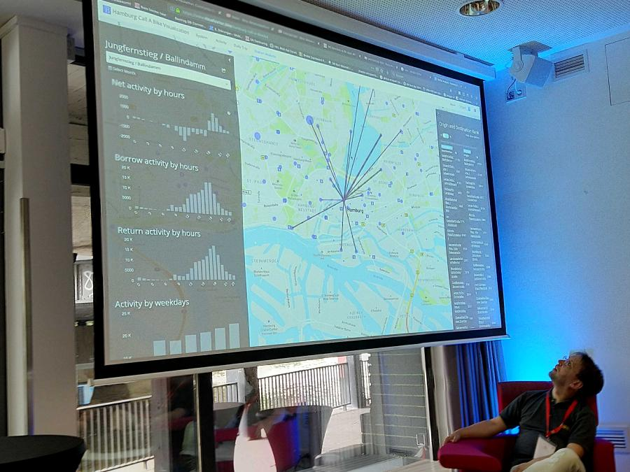

Last week I went to Berlin with [Thorben](https://twitter.com/twesterhuys), where we visited [CityLAB Berlin](https://www.citylab-berlin.org/), a living laboratory of open data that has been inspiring us for a long time. We spent the afternoon getting tours and discussing cooperation ideas. Many thanks to Malgorzata & Benjamin. We then took part in a hackathon organized by the Deutsche Bahn, and learned a few things about the transport open data community up north.

An omnipresent topic was mobility in the form of bike sharing and micromobility. The consensus of bikes as alternative modes of transport, as more sustainable, but yet flexible came to bear in multiple projects. For instance some groups developed prediction ML-models and visualizations around [Call A Bike datasets](https://data.deutschebahn.com/dataset/data-call-a-bike).

# Results

Thorben worked on improving data quality on bike infrastructure in OpenStreetMap, e.g. to improve the basis for analysis. The idea being, that buiding a single-purpose editor for bike stands greatly improves accessability to mapping and has to potential to bring domain specific knowledge into OpenStreetMap even from the less tech savy. A quick proof of concept based on the web editor for OpenStreetMap (iD) can be found over at [tordans/iD](https://github.com/tordans/iD) and a write up on GitHub at [n0rdlicht/fahrradstellplaetze-berlin](https://github.com/n0rdlicht/fahrradstellplaetze-berlin).

Meanwhile, I held conversations with various hackathon participants, from machine learning enthusiasts to consultants, with whom we debated the evolving industrialization of open data (e.g. open data and APIs [working group at Bitkom](https://www.bitkom.org/Bitkom/Organisation/Gremien/Open-Data-Open-API.html)) and role of the civil society.

The result of our exchanges is [a new guide](https://github.com/loleg/earnopendata/blob/master/GUIDE.md) which talks about the skills, opportunities and structures which could boost access to and diversity of the market for open data. It is written from my perspective, sharpened by observations of high level initiatives that are unable to really cater to the 'hackathon hacker', a need to diversify the center where data craftsmanship happens. See http://jobs.opü.ch and [loleg/earnopendata](https://github.com/loleg/earnopendata).

# Experience

> Es gibt nicht nur einen Master-Ansatz, um Probleme zu lösen, daher hat DB mindbox ein Programm eingerichtet, um Probleme in einem neuen Stil anzugehen.
-- dbmindbox.com

[DB mindbox](https://dbmindbox.com/) is an innovation office of DB which runs hackathons every half year, attracting a varied group who by now is experienced and needed minimal hand-holding. People basically all knew what they were doing, and were prepared to try things even if there was a risk of it not working. Very impressive.

Although the [data.deutschebahn.com](https://data.deutschebahn.com/) is technically and in part content-wise getting out of date, there is a wealth of really interesting datasets in there. It's great to see that DB is willing to take some risk and invest into - and share the results - of forays into adjoining fields, such as telecom (Netzradar) and building/geodata (Stuttgart 21).

We got a couple of superb hands-on workshops. IoT and machine learning are big topics in Germany. I had some good conversations with their management about this, I think they would be quite interested to connect more with us as a relay for tech communities in Switzerland. E.g. even though the demo failed during the presentation, I really liked one project where they tried to remote control a station clock in Hamburg. Integration with sharing services is a huge topic, and the ML projects around the detailed [bike sharing dataset](https://data.deutschebahn.com/dataset/data-call-a-bike) were spectacular.

Of course startup seeking was a raison-d'être of the hackathon, so there was a lot of discussion of the sustainability of some of the project ideas. I'm impressed by the commitments of [mFund](https://www.bmvi.de/DE/Themen/Digitales/mFund/) and [DB StartupExpress](https://dbmindbox.com/de/dbstartupxpress/batches/bahnhoefe-und-startups-2019/).

> Mit der Forschungsinitiative mFUND (Modernitätsfonds) fördert das BMVI seit 2016 Forschungs- und Entwicklungsprojekte rund um digitale datenbasierte Anwendungen für die Mobilität 4.0. Neben der finanziellen Förderung unterstützt der mFUND mit verschiedenen Veranstaltungsformaten die Vernetzung zwischen Akteuren aus Politik, Wirtschaft und Forschung sowie den Zugang zum Datenportal mCLOUD.
> -- https://www.bmvi.de/DE/Themen/Digitales/mFund/Ueberblick/ueberblick.html

> In dieser Runde suchen wir wieder Startups im Bereich Einzelhandel, Food und Dienstleistungen. Unser Ziel ist es, das Kundenerlebnis und die Servicequalität an Bahnhöfen zu verbessern.
> -- https://dbmindbox.com/de/dbstartupxpress/batches/bahnhoefe-und-startups-2019/

At the same time the political situation is kind of puzzling. People were talking a lot about this kind of thing..

> _Kommentar: Der Diskurs um Digitalisierung ist kaputt_
> IT-Experten sollten den Digitalisierungs-Diskurs nicht länger Laien überlassen und ihre Kompetenzen in der Politik einsetzen, fordert c't-Redakteur Jan Mahn.
> -- https://www.heise.de/amp/meldung/Kommentar-Der-Diskurs-um-Digitalisierung-ist-kaputt-4473895.html

We look forward to learning more and strengthening exchanges across borders. Many thanks to all for the experience, and to Thorben and the rest of the cividi team for supporting our hackathon efforts.

Further impressions on [Twitter](twitter.com/hashtag/dbhackathon)
