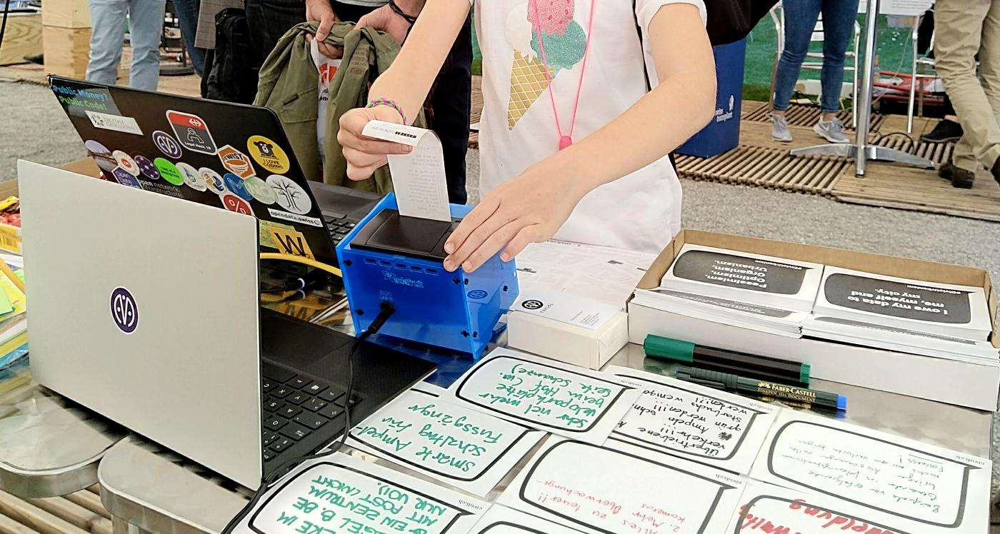
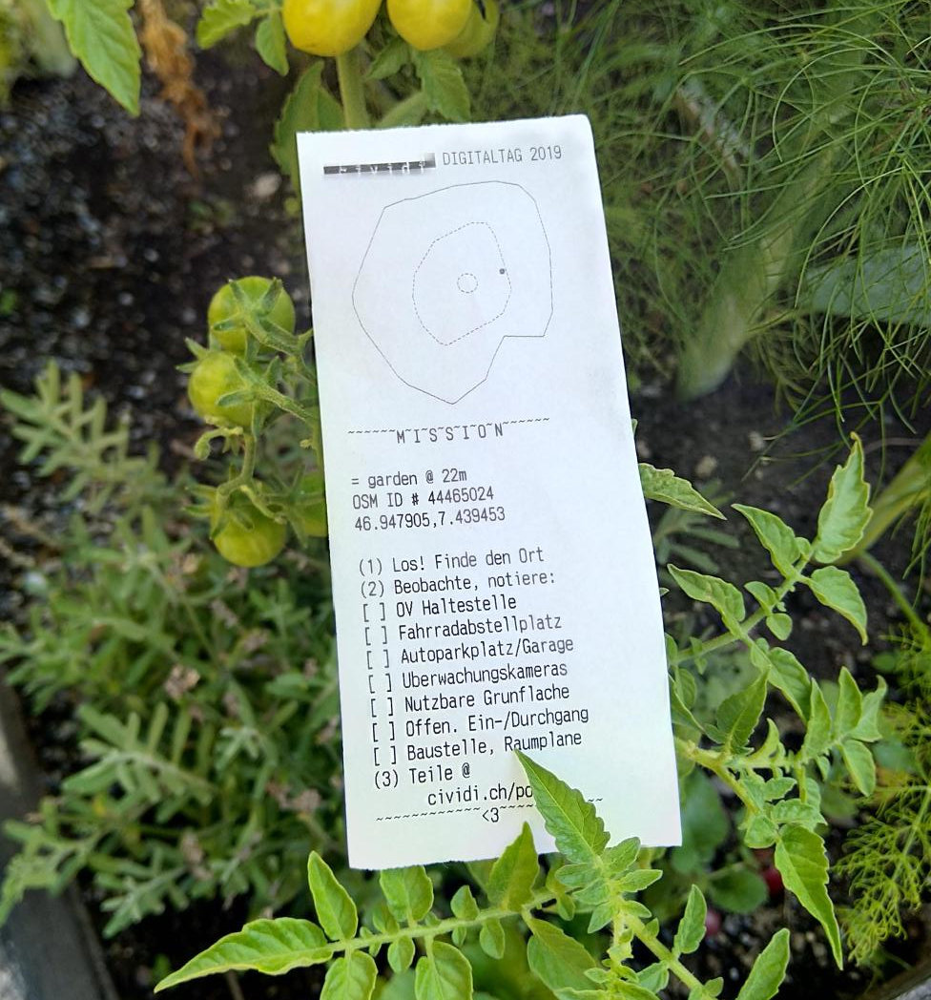
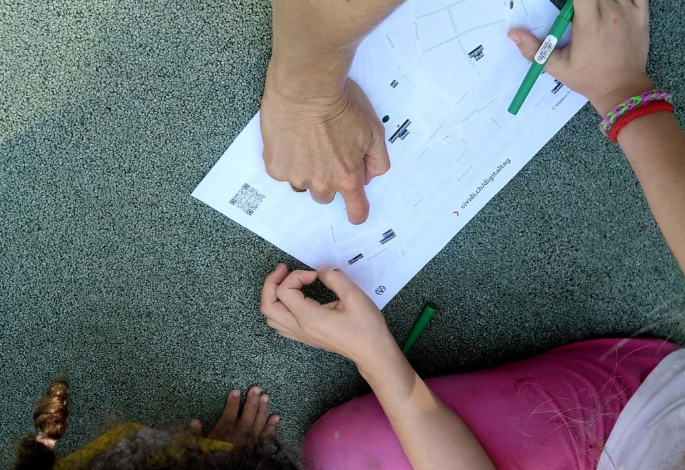

##### The Swiss Digital Day took place for the third time on 3 September. Companies and institutions from all over the country were concerned with the goal of bringing the population closer to digitalisation. And, with support of the [Digital Impact Network](https://www.digitalimpact.ch), we had the privilege to take *cividi* right in the action packed middle, rubbing shoulders with the best of 'em!

In the inner courtyard of the GenerationenHaus, surrounded by urban gardens just a few steps from the SBB main railway station in Bern, we presented the topic _digital tools for analogue spaces_. All around us, the other exhibitors - BFH, wearecube, Inselspital, Swisscom, Bikester, [...](https://bern.impacthub.net/event/digitaltag-bern-2019/) were showing what is already possible, and what's up next in the pipeline of transformative (dare we still say, disruptive?) technologies.

<blockquote class="twitter-tweet">

Erster Fieldtest zu <a href="https://twitter.com/hashtag/civicurbanism?src=hash&amp;ref_src=twsrc%5Etfw">#civicurbanism</a> mit dem <a href="https://twitter.com/hashtag/Datenspaziergang?src=hash&amp;ref_src=twsrc%5Etfw">#Datenspaziergang</a> gestern beim <a href="https://twitter.com/hashtag/DigitalTagBern?src=hash&amp;ref_src=twsrc%5Etfw">#DigitalTagBern</a>. Hat Spass gemacht mit 5-90-jährigen über die Digitalisierung zu reden. Merssi viumau allen fürs Mitmachen und die Unterstützung durch <a href="https://twitter.com/impacthubbern?ref_src=twsrc%5Etfw">@impacthubbern</a>. <a href="https://twitter.com/hashtag/SwissDigitalDay?src=hash&amp;ref_src=twsrc%5Etfw">#SwissDigitalDay</a> <a href="https://twitter.com/dgt_switzerland?ref_src=twsrc%5Etfw">@dgt_switzerland</a>
&mdash; cividi (@cividitech) <a href="https://twitter.com/cividitech/status/1169277627502407686?ref_src=twsrc%5Etfw">September 4, 2019</a></blockquote>

At our stand we showed the versatile possibilities of digital planning and data exchange, with live demos of the [SmartUse.ch](https://smartuse.ch) portal that we built for the Metropolitan Region of Zürich - and which we hope to serve as inspiration and more for [Haupstadtregion](https://hauptstadtregion.ch/) and other Regions! We got enthusiastic responses, particularly from people who liked maps and interactive things, and even several visitors with deep domain knowledge who asked hairy questions and shared pointed advice. Speaking of maps and interactive things ...

The highlight of our booth was [HappyLil'PrintrPi](https://bitbucket.org/cividi/happylilprintrpi/src/master/README.md), first deployed at [Criterion 2019](https://cividi.be/blog/en/2019-04-26) and a trusty companion to our team at public events ever since. It created randomly-generated missions on demand, always within a 5 minute walking radius, in the form of receipts like this one:

In order to give everyone the opportunity to experience the topic on site in the centre of Berne, these self-guided data walks encouraged [spatial orientation awareness](https://www.gislounge.com/spatial-orientation-and-the-brain-the-effects-of-map-reading-and-navigation/), and through them we got lots of great ideas from people who took the missions and filled out our #CivicUrbanism cards with their discoveries and demands.

On top of that, we designed the custom map (shown above) of the area around the GenerationenHaus which was distributed at the infodesk and our booth. It highlighted urban features like car-free roads, rail and tram tracks, co-working spaces, and encouraged map users to submit corrections and discoveries with an online service and QR code inspired by [Field Papers](http://fieldpapers.org/). Stay tuned as we build on these first trials combining the digital and analogue in creative, critical ways.

🚀

If you didn't make it to Bern on Digital Day: no problem! Event organizers Digital Switzerland have a [YouTube channel](https://youtu.be/V-gOB5cbhmQ) on which live contributions of [#SwissDigitalDay](https://twitter.com/hashtag/SwissDigitalDay?src=hash&amp;ref_src=twsrc%5Etfw) were streamed. On Twitter and other social media, there are many other feedbacks and impressions.

Further information on the entire program can be found on the [official website](https://www.digitaltag.swiss/). Because the next time you wonder how to reach a mass audience, even get on [Schweizer Illustrierte](https://www.schweizer-illustrierte.ch/people/talk-town/der-video-livestream-aus-bern-und-zurich), with geeky topics? Pick up your Mut (courage) and brave the curious masses! Digitaltag is an inspiration to those of us who were there to see it happen.
