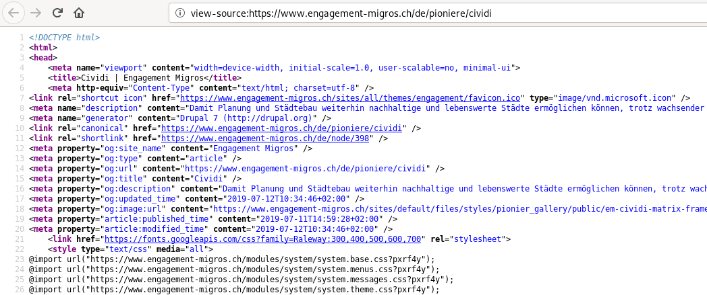

> _"Engagement Migros supports pioneering projects in the midst of social change. The development fund was founded in 2012 as a voluntary commitment by the companies of the Migros Group. With its independent approach, Engagement Migros supplements the funding activities of the Migros Culture Percentage."_

The news of the day is that out project page is now live at [Engagement Migros](https://www.engagement-migros.ch/en/pioneers/cividi), who support us on a mission to refine digital tools for all the analogue cities (and villages, and regions, and people) out there. It is a very big honour for us to be in the esteemed company of the fellow [pioneering projects](https://www.engagement-migros.ch/en/pioniere), such as [Village Office](https://www.engagement-migros.ch/en/pioneers/villageoffice) or [Carvelo](https://www.engagement-migros.ch/en/pioneers/carvelo) just from our _Mobility_ category, . It is a privilege to build on the familiar bedrock of [Culture Percentage](https://www.migros-kulturprozent.ch/). It is a fantastic chance to create a sustainable project that addresses civic issues with support from one of Switzerland's best known institutions, a business that belongs to its customers [since 1941](https://en.wikipedia.org/wiki/Migros#History).

> _"Mobility has its limitations: there are not enough roads or railway lines, which means we must find new solution approaches, as emissions damage the environment and affect our quality of life. Our [pioneering projects](https://www.engagement-migros.ch/en/pioniere) sound out new potential and challenges, establishing models for shared mobility."_

Here is how we describe **Cividi** at net launch:

_In order for city planning and urban development to continue to enable sustainable cities worth living in, despite growing populations, increasing traffic and the internal densification demanded by politicians, they must become participative, evidence-based and smarter. Digitalisation offers new possibilities for analysing and involving the population._

_The pioneering project Cividi provides digital tools for the analogue city, thanks to support from the innovation partner Engagement Migros. It aims to make local concerns visible and to involve civil society in spatial planning. Cividi is establishing a platform for the visualisation and exchange of data on the use of urban space. The platform works with data from government authorities and businesses, but it also offers users the opportunity to make their individual data available for social purposes. A cooperative model for utilisation and further processing is being developed to this end._

_In cooperation with partners from public administration, academia and industry, Cividi is building the foundation for the participatory development and better use of urban spaces and infrastructure – as an alternative to new, expensive construction._

You can read the above in three national languages, check out the whole range of Engagement [projects](https://www.engagement-migros.ch/en/our-role), and sign up to news from the network at [engagement-migros.ch](https://www.engagement-migros.ch/en/pioneers/cividi). Thank you to the team at EM, the fellow pioneers who have supported our entry into the mix. Onwards to the next civic beta!

