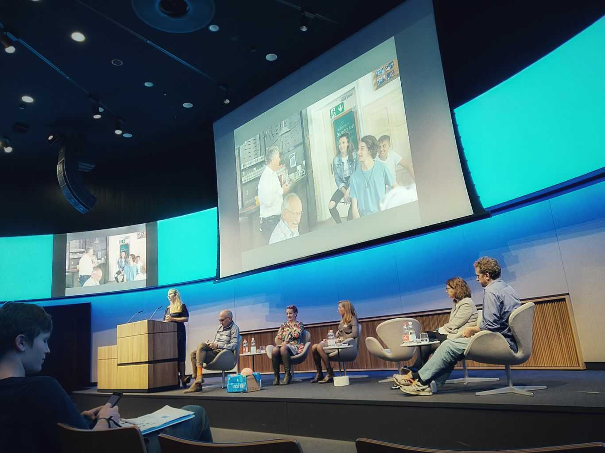
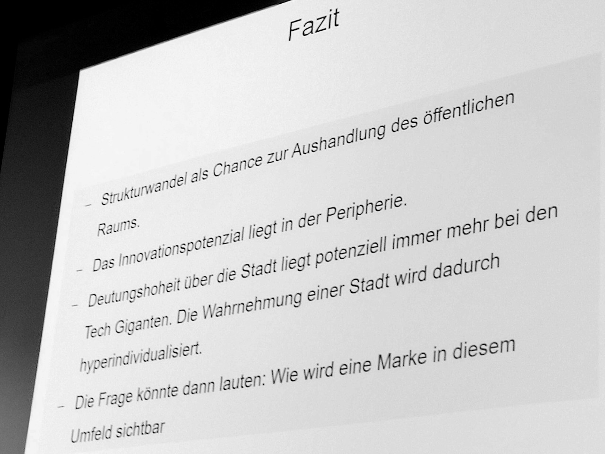
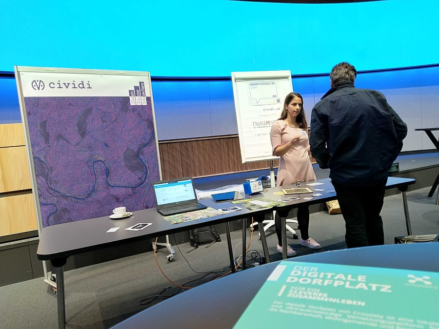

While the risks of digital media for the child are well known, more of us - adults, parents, educators, forward looking politicians - are recognizing that digital technologies even in children's hands can be meaningful tools of democracy. The next generation of so-called digital natives, the adults of tomorrow, should be involved in planning processes at a local political and administrative level.

Such was the thesis of the recent ['Digitales Kind - analoge Gemeinde?' Symposium](https://www.unicef.ch/de/ueber-unicef/aktuell/veranstaltungen/2019-10-28/digitales-kind-analoge-gemeinde) organized by UNICEF on child-friendly living spaces _(Kinderfreundliche Lebensräumen)_, to which our startup team was invited. We (Viktoria and Oleg) participated and put up a **cividi** booth as described in this post. The discussion focused on using new media in dialogue with children and young people, in the form of opportunities and challenges for municipal planning and development.

<small>© UNICEF Switzerland and Liechtenstein / Lucia Pigliapochi</small>

The symposium's esteemed panel took turns presenting a topic - with the nice touch of each presenter bringing a small tangible object to relate to - followed by a group discussion.

In addition to insights into children's rights and political freedoms, the work of the Swiss federal government and examples from specific municipal projects, we got a glimpse of challenges to come through the telescope of [Marta Kwiatkowski](https://www.gdi.ch/en/kwiatkowski-schenk-marta) who studies [the future](https://www.gdi.ch/de/publikationen/studien-buecher/future-public-space) at the Gottlieb Duttweiler institute, and brings back some very provocative ideas:

- _Structural change as an opportunity to negotiate public space._
- _Innovative potential lies in the periphery._
- _Authoritative potential for city development lies more and more with tech giants._
  - _The perception of a city is thus hyperindividualized._
- _The question could then be:_
  - _how does a brand_ [or a concept] _become visible in this environment?_

After the morning presentations and lunch networking, we set up a stand similar to our pitch at [Swiss Digital Day](https://cividi.be/blog/en/2019-09-03) - as part of the afternoon “Digital Market”, where we had a chance to encounter and get feedback from the participants. These were politically involved, young and old, from city halls, planning offices of several communes, professionals in spatial planning and development, architecture and traffic planning, social work, the academic and startup spheres.

Building on [previous events](https://cividi.be/blog/en/2019-09-03), our pitch shifted from digital gadgets - printer challenges and data walk assignments - to conversations: giving us a chance to gather product-related inputs from experts and digital- or urbanism-savvy citizens. Next to us were the booths of [Crossiety](https://www.crossiety.ch/), [Engage.ch](https://www.engage.ch/), [Urban Equipe](https://www.urban-equipe.ch/), who we already know through the civic tech community and whose expeditions we participated in, as well as relative newcomers [smalljobs.ch](http://smalljobs.ch/), and visitors [#stadtsache](https://stadtsache.de/) and [Mineschool](https://prezi.com/ybw0x48lzavj/minecraft-als-e-partizipations-tool/). The hosts also ran their own stand explaining their children-friendly [cities certification](https://www.unicef.ch/de/unsere-arbeit/schweiz-liechtenstein/kinderfreundliche-gemeinde), to which the 40th Swiss municipality, [Beringen](https://en.wikipedia.org/wiki/Beringen,_Switzerland), was [recently added](https://www.unicef.ch/de/ueber-unicef/aktuell/medienmitteilungen/2019-06-29/beringen-erhalt-als-40-kinderfreundliche).

Our pitch? The pioneering project **[cividi](https://cividi.ch)**, supported by the innovation partner Engagement Migros, provides digital tools for the analog city to make planning processes participative, evidence-based and smarter. On data walks - inspiring visitors of all ages - urban spaces can be experienced physically and virtually, so that our participants develop a better spatial perception and leave their mark in the data.

In the meantime, follow us on [social media](https://twitter.com/cividitech) and join our team for the live net-discussion [on November 20](https://www.un.org/en/events/childrenday/) in advocating, promoting and celebrating the Universal Rights of Children.

Thank you to Anja Bernet, Manuela Chablais, and the whole team at [UNICEF Schweiz und Liechtenstein](https://unicef.ch) for their support. Looking forward to being part of more Youth Activities in the future!
